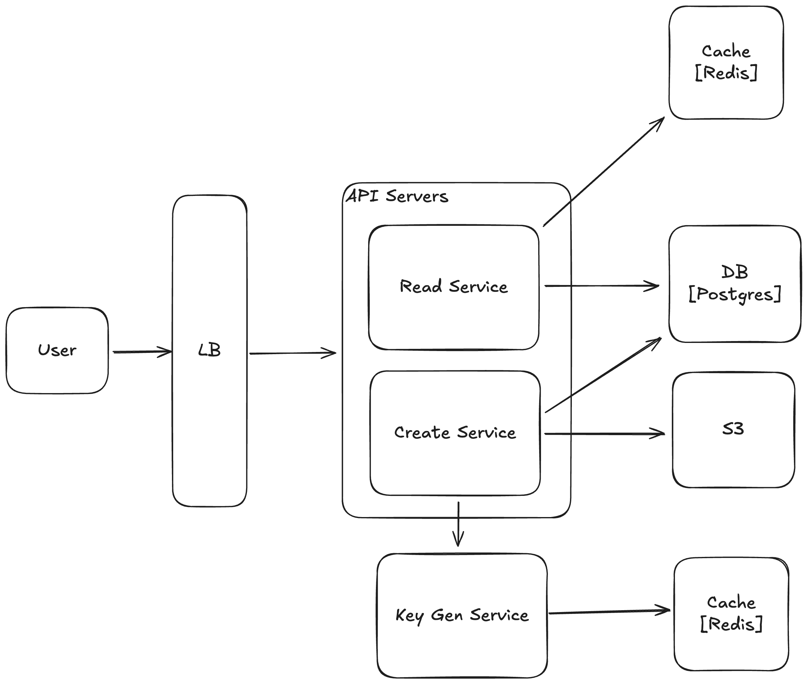
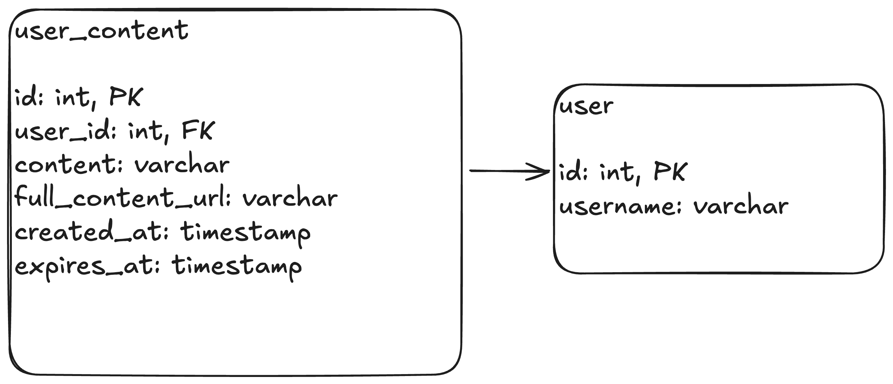

# Text Storage Service (Pastebin)

## Functional Requirements
- Users are able to save text content and get a shareable url
- Users can access the saved text content using the url
- Text content size is limited to 10MB

## Non-Functional Requirements
- High availability (the service should be up 99.9% of the time)
- Low latency (user should get the content in milli seconds)
- Scalability (the system should handle millions of requests per day)
- Durability (saved content should work for years)

## Design

- [design components descriptions]

## Database schema

## Capacity estimation
- Daily create requests: 1 Million 
- Assuming 10:1 read write ratio
- Daily read requests: 10 Million
- Avg text size: 100 KB
- Peak load: 10x the average

#### Throughput
Avg writes per second: 1M / (60 * 60 * 24) = 12
Avg reads per second: 12 * 10 = 120
Peak RPS: 1200

#### Storage
- [storage calculations]

## Highlights
- [list of important points related to the design]