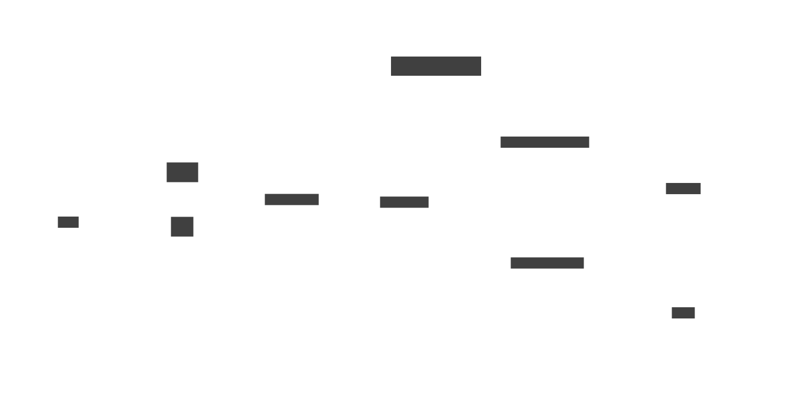

# URL Shortener

## Requirements

#### Functional
1. Generate a unique short URL for a given long URL
2. Redirect the user to the original URL when the short URL is accessed
4. Support link expiration where URLs are no longer accessible after a certain period
3. Allow users to customize their short URLs (optional)
5. Provide analytics on link usage (optional)

#### Non-Functional
1. High availability (the service should be up 99.9% of the time)
2. Low latency (url shortening and redirects should happen in milliseconds)
3. Scalability (the system should handle millions of requests per day)
4. Durability (shortened URLs should work for years)
5. Security to prevent malicious use, such as phishing.

## Design

## Database schema

