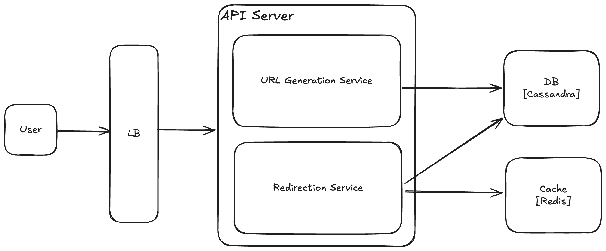

# URL Shortener

## Requirements

#### Functional
1. Generate a unique short URL for a given long URL
2. Redirect the user to the original URL when the short URL is accessed
4. Support link expiration where URLs are no longer accessible after a certain period
3. Allow users to customize their short URLs (optional)
5. Provide analytics on link usage (optional)

#### Non-Functional
1. High availability (the service should be up 99.9% of the time)
2. Low latency (url shortening and redirects should happen in milliseconds)
3. Scalability (the system should handle millions of requests per day)
4. Durability (shortened URLs should work for years)

## Design

- LB - Load Balancer distributing requests across API servers
- API Servers - Backend application servers handling url shorting and redirection requests
- URL Generation Service - Creates short url and saves to DB
- Redirection Service - Retrives original url based on the short url from Cache or DB and redirects the user to the original url
- DB - Stores short url to original url mapping. Since the database needs high throughput to handle large number of reads as compared to writes and don't require joins between tables - A NoSQL DB like **Cassandra** is a good choice
- Cache - Stores frequently accessed url for fast retrival. Eg. Redis/Memcache

## Database schema

## Capacity estimation
- Daily shorten url requests: 1 Million
- Read/Write ratio: 100:1 (100 redirects for 1 shortened url per day)
- Peak load: 10x the avg
- Avg original url length: 100 characters

#### Throughput
- Avg writes per second: 1M / (60 * 60 * 24) ~ 12
- Peak WPS: 12 * 10 = 120
- Avg redirects: 12 * 100 = 1,200
- Peak RPS: 1200 * 10 = 12,000

#### Storage
- Short URL: 7 bytes (assuming 7 characters in short url)
- Original URL: 100 bytes
- Creation date: 8 bytes (timestamp)
- Expiration date: 8 bytes (timestamp)
- Click count: 4 bytes

Total Storage per url
- **7 + 100 + 8 + 8 + 4 = 127**

Total storage per Year: 
- **1M * 127 * 360 = 43.2 GB**

### Highlights

##### Hashing
Encript the original url using MDN or SHA-256 and then encode the encripted url to a fix length string using base62 encoding. Base62 encoding with 7 characters provides large number of combinations (7^62 = 3.5 Trillion)
To handle collision, re-encript the original url with a different seed or add an incremental suffic to the generate short url and re-encode using base62

##### Auto Increment ID
Use the database auto-increment ID to generate a number and encode it using base62. But this approach is very predictable and might become scalability bottelneck for the DB
